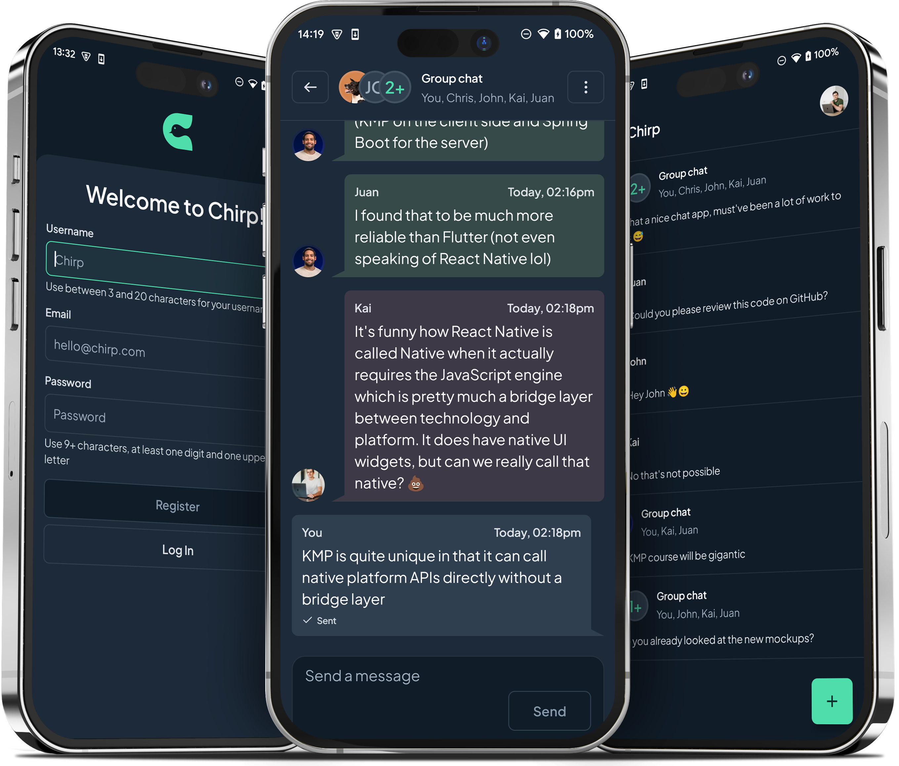
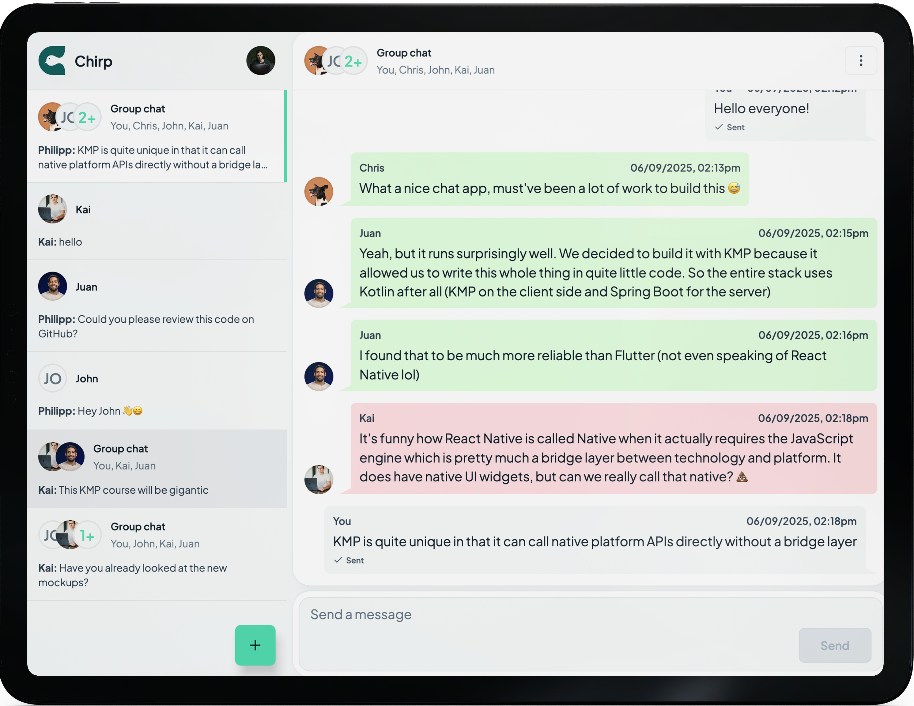

# Chirp

Chirp is a multi-platform real-time messaging app for Android, iOS, and Desktop devices built with Kotlin Multiplatform and Compose Multiplatform.

### Mobile View  

  

### Desktop, Foldable & Tablet View

  

## What's covered?

- Kotlin Multiplatform & Compose Multiplatform
- Clean Architecture principles
- Multi-module architecture for KMP projects
- Gradle configuration for cross-platform development
- Authentication (JWT token management)
- Real-time messaging with WebSocket
- Push notifications with Firebase
- Room for local database
- Desktop app development
- Desktop, iOS and Android native integrations

# Technology Stack
- [Kotlin Multiplatform & Compose multiplatform](https://github.com/JetBrains/compose-multiplatform)
- [Firebase](https://firebase.google.com/)
- [Coroutines](https://github.com/Kotlin/kotlinx.coroutines) + [Flow](https://kotlin.github.io/kotlinx.coroutines/kotlinx-coroutines-core/kotlinx.coroutines.flow/) for asynchronous.
- [Ktor](https://github.com/ktorio/ktor): for making network requests.
- [Room](https://developer.android.com/kotlin/multiplatform/room): for local database.
- [Koin](https://github.com/InsertKoinIO/koin): a pragmatic lightweight dependency injection framework.
- [DataStore KMP](https://developer.android.com/kotlin/multiplatform/datastore): to store data asynchronously in a key-value pairs.
